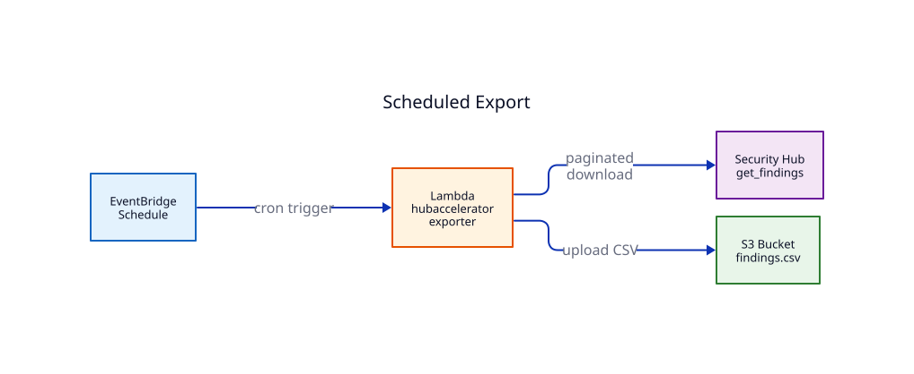
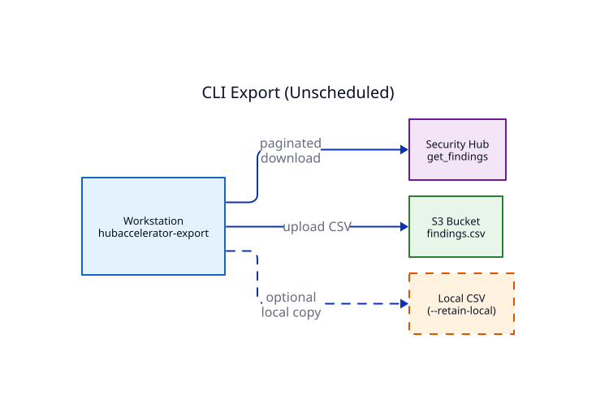
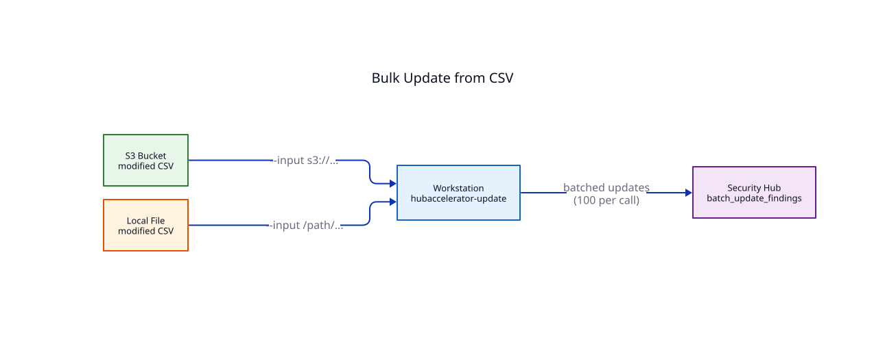

# HubAccelerator

**The Security Hub Backlog Accelerator**

HubAccelerator exports AWS Security Hub findings to CSV and allows bulk updates by editing the CSV — converting a per-finding console workflow into a spreadsheet-driven bulk operation.

## The Problem

AWS Security Hub aggregates findings from GuardDuty, Inspector, Macie, Config, and third-party tools. Organizations with even modest AWS environments accumulate thousands to millions of findings. The Security Hub console allows updating findings one at a time. Automation Rules (introduced 2023) handle pattern-based suppression, but periodic manual review of large finding sets — annotating, accepting, suppressing, or escalating — still requires a bulk workflow that the console does not provide.

## What HubAccelerator Does

**HubAccelerator Exporter (`csvExporter.py`)** exports Security Hub findings to a CSV file stored in S3. It can run as:
- A CLI command from your workstation
- An AWS Lambda function on a schedule (via EventBridge)
- An SSM Automation for on-demand execution

**HubAccelerator Updater (`csvUpdater.py`)** reads a modified CSV and pushes changes back to Security Hub via the `BatchUpdateFindings` API. Updatable fields include:
- **Workflow status** — NEW, NOTIFIED, SUPPRESSED, RESOLVED
- **Severity** — override the scanner's severity with your own assessment
- **Confidence** — your confidence in the finding's accuracy
- **Criticality** — business criticality of the affected resource
- **Note** — free-text annotation explaining your disposition
- **User-defined fields** — custom key-value pairs for organizational tracking

## Architecture

### Scheduled Export


EventBridge triggers the export Lambda on a cron schedule. Findings are downloaded from Security Hub across all configured regions (in parallel) and uploaded as a CSV to S3.

### CLI Export


Run `hubaccelerator-export` from any workstation with AWS credentials. Optionally retain a local copy for immediate editing.

### Bulk Update


Edit the exported CSV (in Excel, a text editor, or programmatically), then run `hubaccelerator-update` to push changes back to Security Hub in batches of 100 findings per API call.

### Local File Support

Both the exporter and updater support local file operations as an alternative to S3. The exporter can write findings directly to a local CSV file (use `--retain-local` to keep it), and the updater can read from either an S3 URL (`s3://bucket/key`) or a local file path. This is often the most direct workflow for analysts working from their workstation:

```bash
# Export to S3 and keep a local copy
python3 src/csvExporter.py --role-arn ... --primary-region us-east-1 \
  --bucket my-bucket --retain-local

# Edit the local CSV in Excel, then update directly from the local file
python3 src/csvUpdater.py --role-arn ... --primary-region us-east-1 \
  --input /tmp/findings-2026-04-16.csv
```

## Requirements

- Python 3.12+ (Lambda runtime; CLI works with 3.9+)
- AWS credentials with Security Hub read access (exporter) and write access (updater)
- An S3 bucket for storing exported findings
- An IAM role for Lambda execution (if using scheduled exports)
- GovCloud compatible (aws and aws-us-gov partitions supported)

## Installation

### Infrastructure (CDK)

A single CDK stack in `cdk/` provisions all required AWS resources:

```bash
cd cdk
npm install
cdk deploy
```

This creates: S3 bucket (encrypted, versioned, object lock, lifecycle policies), SSM parameters, IAM role, Lambda functions (exporter + updater), and an EventBridge schedule for automated exports.

Override defaults via CDK context:
```bash
cdk deploy --context exportSchedule="cron(0 6 ? * MON-FRI *)" \
           --context regions="us-east-1,us-west-2"
```

Legacy CloudFormation templates are retained in `cfn/` for reference.

### Install

From the repository root (where `pyproject.toml` is):

```bash
cd hubaccelerator.rescor.net
pip install .

# Or for development (editable — changes take effect immediately):
pip install -e .

# Or install directly from GitHub:
pip install git+https://github.com/RESCOR-LLC/hubaccelerator.rescor.net.git
```

This installs two commands available from any directory:
- `hubaccelerator-export` — export Security Hub findings to CSV
- `hubaccelerator-update` — bulk update findings from a modified CSV

### CLI Usage

```bash
# Export findings (bucket and region default from SSM/env if configured)
hubaccelerator-export --primary-region us-east-1

# Export with explicit options
hubaccelerator-export \
  --role-arn arn:aws:iam::ACCOUNT:role/HubAcceleratorRole \
  --primary-region us-east-1 \
  --bucket your-findings-bucket \
  --filters HighActive \
  --retain-local

# Update findings from modified CSV
hubaccelerator-update \
  --primary-region us-east-1 \
  --input s3://your-findings-bucket/Findings/latest.csv

# Update from a local file
hubaccelerator-update \
  --primary-region us-east-1 \
  --input /path/to/modified-findings.csv
```

## Project Structure

```
hubaccelerator.rescor.net/
├── pyproject.toml              — pip install configuration
├── README.md
├── src/hubaccelerator/
│   ├── __init__.py
│   ├── exporter.py             — Export findings to CSV (CLI + Lambda)
│   ├── updater.py              — Bulk update findings from CSV (CLI + Lambda)
│   └── objects.py              — Shared AWS service abstractions
├── cdk/
│   ├── hubaccelerator-stack.js — CDK infrastructure (S3, Lambda, IAM, SSM)
│   └── cdk-app.js
├── cfn/                        — Legacy CloudFormation (reference only)
├── docs/
│   ├── diagrams/               — D2 source + rendered SVG
│   └── legacy/                 — Original docx/pptx/pdf (reference)
└── archive/                    — Applied patches (historical)
```

## Configuration

HubAccelerator reads configuration from AWS Systems Manager Parameter Store under the `/csvManager/` prefix:

| Parameter | Description |
|-----------|-------------|
| `/csvManager/regionList` | Comma-separated list of regions to scan |
| `/csvManager/bucket` | S3 bucket name for findings |
| `/csvManager/folder/findings` | S3 prefix for exported CSV files |

Environment variables override SSM parameters:
- `HUBACCELERATOR_REGIONLIST` — region list override
- `HUBACCELERATOR_BUCKET` — bucket override
- `HUBACCELERATOR_REGION` — primary region (also used as CLI default)

Legacy names (`CSV_SECURITYHUB_REGIONLIST`, `CSV_PRIMARY_REGION`, `CSV_SECURITYHUB_BUCKET`) are still accepted with a deprecation warning.

## Updatable Columns

The following CSV columns can be modified and pushed back to Security Hub via `hubaccelerator-update`. Other columns are read-only (changes are silently ignored).

| Column | Description | Valid Values |
|--------|-------------|-------------|
| Confidence | Your confidence in the finding | Integer 0–100 |
| Criticality | Business criticality of affected resource | Integer 0–100 |
| NoteText | Annotation explaining your disposition | Free text |
| CustomerOwner | Owner (email, username, etc.) | Free text |
| CustomerIssue | Issue tracker ID (e.g., JIRA DSP-789) | Free text |
| CustomerTicket | Ticket number (e.g., ServiceNow) | Free text |
| ProductSeverity | Override the scanner's native severity | Float |
| SeverityLabel | Severity category | INFORMATIONAL, LOW, MEDIUM, HIGH, CRITICAL |
| VerificationState | Finding accuracy assessment | UNKNOWN, TRUE_POSITIVE, FALSE_POSITIVE, BENIGN_POSITIVE |
| Workflow | Triage status | NEW, NOTIFIED, SUPPRESSED, RESOLVED |

The CSV also includes 25+ read-only columns (Title, Description, Resources, ComplianceStatus, etc.) for analysis and filtering.

## Relationship to AWS Security Hub Native Features

Security Hub's [Automation Rules](https://docs.aws.amazon.com/securityhub/latest/userguide/automation-rules.html) (2023) cover pattern-based auto-suppression — "whenever finding X matches criteria Y, suppress it." This handles the "suppress this forever" use case.

HubAccelerator complements Automation Rules for the use case they don't cover: **periodic manual review of large finding sets**. When an analyst needs to review 500 findings, make disposition decisions in a spreadsheet, and push those decisions back to Security Hub in bulk, HubAccelerator provides the workflow.

## Troubleshooting

### Security Hub not enabled

```
Account XXXX is not subscribed to AWS Security Hub
```

Enable Security Hub in your primary region:

```bash
aws securityhub enable-security-hub --region us-east-1 --enable-default-standards
```

### No finding aggregator

If `hubaccelerator-export` falls back to SSM/environment for region configuration, you may not have cross-region aggregation configured. Create an aggregator:

```bash
aws securityhub create-finding-aggregator \
  --region us-east-1 \
  --region-linking-mode ALL_REGIONS
```

### InvalidClientTokenId in some regions

```
skipping region ap-southeast-3 (not enabled or no access): InvalidClientTokenId
```

This is normal — opt-in regions (Bahrain, Cape Town, Jakarta, etc.) require explicit enablement in your AWS account before credentials work there. HubAccelerator skips these regions automatically and continues with the regions that are accessible.

### AWS Organizations / multi-account setup

For organizations using AWS Control Tower or multi-account Security Hub:

1. **Enable Security Hub** on the management account (or let Control Tower do it)
2. **Designate a delegated administrator** (typically the Audit account):
   ```bash
   aws securityhub enable-organization-admin-account \
     --admin-account-id AUDIT_ACCOUNT_ID
   ```
3. **Create a finding aggregator** to pull findings from all regions
4. **Run HubAccelerator** from the management account or the delegated admin account — either works, but the delegated admin is the intended pattern

### Control Tower

If your organization uses AWS Control Tower, Security Hub may be enabled automatically when the landing zone is created or updated. Check the landing zone status:

```bash
aws controltower get-landing-zone \
  --landing-zone-identifier $(aws controltower list-landing-zones \
    --query 'landingZones[0].arn' --output text) \
  --query 'landingZone.{Status:status,Version:version}'
```

If the landing zone is still `PROCESSING`, wait for it to complete before enabling Security Hub manually.

## License

HubAccelerator is licensed under the GNU Affero General Public License v3.0 (AGPL-3.0). See [LICENSE](LICENSE) for the full text.

In short: you can use, modify, and redistribute this code under the terms of the AGPL-3.0. If you run a modified version on a network service, you must make the source available to users of that service.

## Reporting security issues

See [SECURITY.md](SECURITY.md). Please do not file public issues for vulnerabilities; email the address listed there.

## Contributing

Contributions welcome. See [CONTRIBUTING.md](CONTRIBUTING.md).

## Author

Andrew T. Robinson — [LinkedIn](https://linkedin.com/in/atrobinson)
